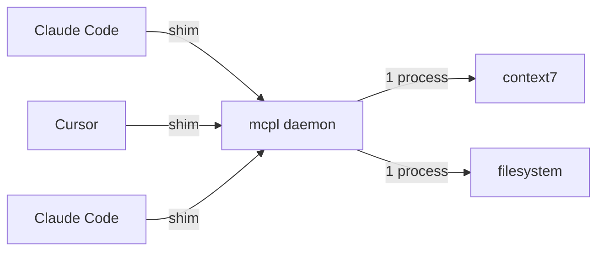

<p align="center">
  <h1 align="center">mcpl</h1>
  <p align="center">
    <b>Share MCP servers across all your editors.</b>
    <br/>One daemon. Multiple sessions. Zero restarts.
  </p>
  <p align="center">
    <a href="#quick-start">Quick Start</a> ·
    <a href="#commands">Commands</a> ·
    <a href="#configuration">Configuration</a>
  </p>
  <p align="center">
    
    
    
  </p>
</p>

## What is mcpl?

Every time you open Claude Code, Claude Desktop, or Cursor, each session spawns its own copy of every MCP server you have configured. Five editor windows means five copies of the same servers running in parallel -- eating memory and taking time to start up.

**mcpl** fixes this. It runs a single background daemon that manages your MCP servers as shared subprocesses. Editor sessions connect through lightweight shims instead of spawning their own servers. When you close a session, the servers keep running. When you open a new session, it connects instantly -- no cold starts, no restarts.

The result: instant reconnects, servers that survive between sessions, and less memory.

### Benchmarks

Real-world numbers from a macOS (Apple Silicon) machine with 6 stateless MCP servers across ~12 editor sessions:

| Server | Instances | Memory each | Without mcpl | With mcpl |
|---|---:|---:|---:|---:|
| context7 | 23 | 31 MB | 711 MB | 31 MB |
| sequential-thinking | 24 | 28 MB | 664 MB | 28 MB |
| filesystem | 12 | 26 MB | 312 MB | 26 MB |
| obsidian | 11 | 28 MB | 306 MB | 28 MB |
| zai | 10 | 30 MB | 299 MB | 30 MB |
| tavily | 3 | 46 MB | 138 MB | 46 MB |
| **Total** | **83** | | **2.4 GB** | **189 MB** |

Each server runs once and is shared across all sessions. The shims that connect editors to the daemon add ~6 MB each.

**Startup time:**

| | Without mcpl | With mcpl |
|---|:---:|:---:|
| Every session | ~1.0s cold start | 0.003s (server already running) |

Servers start once and stay running across sessions. Close your editor, reopen it -- instant reconnect, no cold start.

## When you need this

- You run **multiple editor sessions** (Claude Code, Claude Desktop, Cursor) at the same time
- You have **several MCP servers** configured and feel the memory overhead
- You're tired of **waiting for servers to restart** every time you open an editor
- You want servers to **stay alive** between sessions instead of stopping and starting

## When you don't need this

- You only use **one editor session** at a time
- You have **one or two lightweight** MCP servers
- You're on **Windows** (mcpl uses Unix sockets, so macOS and Linux only)

## How it works



1. **Shim** -- a tiny stdio proxy (`mcpl connect <name>`) that sits where your MCP server command used to be. It bridges your editor's stdin/stdout to the daemon over a Unix socket.
2. **Daemon** -- a long-running background process that spawns and manages MCP server subprocesses. It starts automatically on first connection.
3. **ID remapping** -- the daemon rewrites JSON-RPC request IDs to prevent collisions when multiple sessions talk to the same server, then rewrites them back so each session sees the IDs it expects.

Servers start lazily on first use and stop after an idle timeout (default 10 minutes). The daemon itself shuts down after all servers are idle (default 30 minutes) and restarts automatically on the next connection.

## Quick Start

### Install

```bash
brew install davebream/tap/mcpl
```

<details>
<summary>Other installation methods</summary>

**From source:**
```bash
go install github.com/davebream/mcpl@latest
```

**From GitHub releases:**

Download a prebuilt binary from [Releases](https://github.com/davebream/mcpl/releases) for macOS (Intel/Apple Silicon) or Linux (amd64/arm64).

</details>

### Set up

```bash
# Preview what mcpl will do (dry run, no changes)
mcpl init --diff

# Apply -- creates mcpl config and rewrites editor configs to use shims
mcpl init --apply
```

That's it. Your existing MCP server definitions are merged into a single mcpl config, and your editor configs are rewritten to point at mcpl shims. Backups of your original configs are saved as `.mcpl.bak` files.

Next time you open Claude Code or Cursor, your servers will be shared through the daemon.

### Verify

```bash
mcpl doctor
```

This checks your config, socket, daemon process, and server commands.

### Undo

If you want to go back to the way things were:

```bash
mcpl init --restore
```

This restores your editor configs from the `.mcpl.bak` backups.

## Commands

| Command | Description |
|---------|-------------|
| `mcpl init` | Detect MCP servers from editors and create mcpl config |
| `mcpl add` | Add a new MCP server |
| `mcpl remove` | Remove an MCP server |
| `mcpl connect` | Stdio shim (used in editor configs, not run directly) |
| `mcpl status` | Show daemon status |
| `mcpl stop` | Stop the daemon |
| `mcpl restart` | Restart the daemon |
| `mcpl logs` | Show daemon logs |
| `mcpl doctor` | Check installation and configuration |
| `mcpl version` | Print version info |

### `mcpl init`

Scans Claude Code, Claude Desktop, and Cursor configs for MCP server definitions, merges them into a single mcpl config, and rewrites editor configs to use shims.

```bash
mcpl init --diff      # Preview changes (dry run)
mcpl init --apply     # Apply changes
mcpl init --restore   # Revert from backups
```

If two editors define the same server name with different settings, mcpl reports the conflict and asks you to resolve it manually.

### `mcpl add`

Add a new MCP server to mcpl and all detected editor configs.

```bash
# From command line
mcpl add context7 npx -y @upstash/context7-mcp

# Stateful server — editor manages process directly, no multiplexing
mcpl add playwright npx -y @playwright/mcp --unmanaged

# From JSON
echo '{"command":"npx","args":["-y","@upstash/context7-mcp"]}' | mcpl add context7 --json -
```

### `mcpl remove`

Remove a server from mcpl and all detected editor configs.

```bash
mcpl remove context7
```

### `mcpl status`

Check if the daemon is running and reachable.

```bash
mcpl status
# Daemon: running (PID 12345)
# Socket: /tmp/mcpl-501/mcpl.sock
```

### `mcpl logs`

View daemon logs.

```bash
mcpl logs          # Last 50 lines
mcpl logs -f       # Follow (live tail)
```

### `mcpl doctor`

Run diagnostic checks on your installation.

```bash
mcpl doctor
# Config:  OK (5 servers, ~/Library/Application Support/mcpl/config.json)
# Socket:  OK (0600, /tmp/mcpl-501/mcpl.sock)
# Daemon:  OK (PID 12345)
# Connect: OK
# Server context7: OK (npx)
# Server playwright: OK (unmanaged, npx)
```

## Configuration

mcpl stores its config at:

| Platform | Path |
|----------|------|
| macOS | `~/Library/Application Support/mcpl/config.json` |
| Linux | `~/.config/mcpl/config.json` |

Override with the `MCPL_CONFIG_DIR` environment variable.

### Config format

```json
{
  "idle_timeout": "30m",
  "server_idle_timeout": "10m",
  "log_level": "info",
  "servers": {
    "context7": {
      "command": "npx",
      "args": ["-y", "@upstash/context7-mcp@latest"]
    },
    "filesystem": {
      "command": "npx",
      "args": ["-y", "@modelcontextprotocol/server-filesystem", "/home/user"],
      "env": {
        "NODE_ENV": "production",
        "API_KEY": "$MY_API_KEY"
      }
    },
    "playwright": {
      "command": "npx",
      "args": ["-y", "@playwright/mcp"],
      "managed": false
    }
  }
}
```

### Top-level options

| Option | Default | Description |
|--------|---------|-------------|
| `idle_timeout` | `30m` | Daemon shuts down after all servers are idle for this long |
| `server_idle_timeout` | `10m` | Individual server stops after no connections for this long |
| `log_level` | `info` | Log level: `debug`, `info`, `warn`, `error` |

### Per-server options

| Option | Required | Description |
|--------|----------|-------------|
| `command` | yes | Executable to run (no shell invocation, direct exec only) |
| `args` | no | Arguments array |
| `env` | no | Environment variables. Use `$VAR` syntax to reference the host environment at spawn time -- keeps secrets out of the config file. |
| `serialize` | no | Force sequential request processing for servers that can't handle concurrent requests |
| `managed` | no | Set to `false` for stateful servers (e.g. playwright). mcpl tracks the server but editors manage the process directly -- no multiplexing. Default: `true`. |

## Supported clients

mcpl auto-detects and rewrites configs for these editors:

| Client | Config path |
|--------|------------|
| Claude Code | `~/.claude.json` |
| Claude Code (project) | `~/.claude/settings.local.json` |
| Claude Desktop | `~/Library/Application Support/Claude/claude_desktop_config.json` |
| Cursor | `~/.cursor/mcp.json` |

After `mcpl init --apply` or `mcpl add`, your editor configs will contain shim entries like:

```json
{
  "mcpServers": {
    "context7": {
      "command": "mcpl",
      "args": ["connect", "context7"]
    }
  }
}
```

## Limitations

mcpl multiplexes multiple editor sessions through a single server process. This works well for stateless tool servers (the common case), but has inherent tradeoffs:

- **No per-session state isolation.** If a server maintains internal state (caches, conversation context), all sessions share it. One session's actions can affect another's responses.
- **Single point of failure.** Without mcpl, one editor crash only kills that editor's servers. With mcpl, a daemon crash disconnects all sessions at once. The daemon restarts automatically on the next connection, but all servers cold-start.

These tradeoffs don't matter for most MCP servers (tool providers like context7, filesystem are stateless). For servers where shared state is a problem, set `"managed": false` so each editor manages its own instance.

## Troubleshooting

**Daemon won't start?**
```bash
mcpl doctor        # Check everything
mcpl logs          # Check for errors
```

**Want to start fresh?**
```bash
mcpl init --restore   # Restore original editor configs
mcpl stop             # Stop the daemon
```

**Server keeps crashing?**

Check the logs with `mcpl logs -f`. If a server crashes 3 times within 60 seconds, it's marked as failed and won't auto-restart. Run `mcpl restart` to reset the crash counter and try again.

**Config changes not taking effect?**

The daemon picks up newly added servers on each new connection -- just open a new editor session. For changes to existing servers (command, args, env), run `mcpl restart` to apply.

## License

MIT
